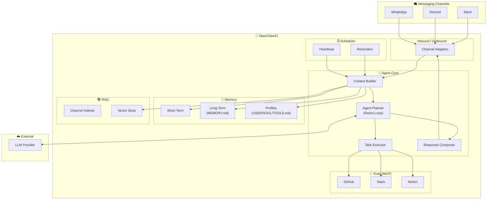
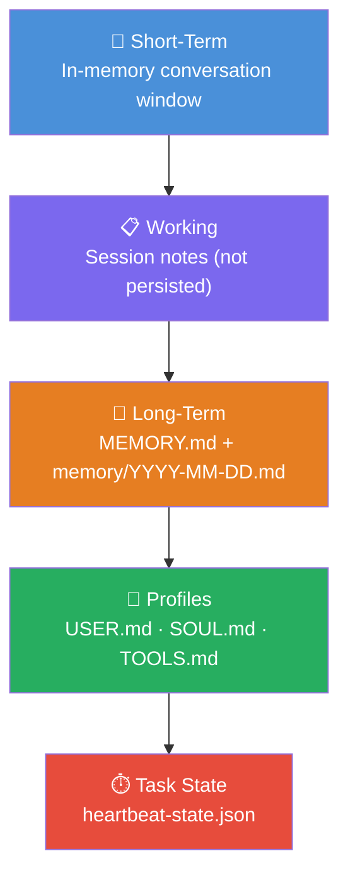

# 🦞 OpenClaw4J

> **An autonomous AI agent framework for Java** — built with Spring Boot 3.5.10, Spring AI 1.1.2, and Java 25.

OpenClaw4J is an intelligent agent that lives inside your messaging channels. Send it a message in natural language — it reads, understands, plans, and executes tasks using LLM reasoning, MCP tools, RAG retrieval, and layered persistent memory — then reports back in the same channel.

---

## Architecture Overview



## How It Works

```
User sends message in Slack
        │
        ▼
┌─────────────────────────────┐
│  1. Channel Adapter         │  Normalize platform event → InboundMessage
├─────────────────────────────┤
│  2. Context Builder         │  Assemble memory + RAG + history + tools
├─────────────────────────────┤
│  3. Agent Planner (ReAct)   │  LLM reasons: Think → Act → Observe → Repeat
├─────────────────────────────┤
│  4. Task Executor           │  Invoke MCP tools (GitHub, Slack, Notion…)
├─────────────────────────────┤
│  5. Response Composer       │  Format result for the target channel
├─────────────────────────────┤
│  6. Channel Adapter         │  Post response back to Slack
└─────────────────────────────┘
        │
        ▼
User receives agent response
```

## Key Features

| Feature | Description |
|---------|-------------|
| **Multi-channel** | Slack (MVP), WhatsApp, Console → Discord |
| **Agentic reasoning** | ReAct loop with LLM-powered planning |
| **Resilience** | Automatic retries via **Spring Retry** and error feedback |
| **Observability** | Standardized tracing and metrics via **OpenTelemetry** and **Micrometer** |
| **Compound Tasks** | Multi-step task planning and sequential tool orchestration |
| **Local & MCP tools** | GitHub, Slack, Clock, Web Search (Tavily), Memory Curation, Notion |
| **RAG knowledge** | Vector-indexed channel history for contextual answers |
| **Layered memory** | Short-term → working → long-term → profiles → task state (with search & curation) |
| **Reminders** | Time-based reminders with cron scheduling |
| **Advanced Heartbeat** | Periodic checks with system-wide event broadcasting |
| **RAG Toggle** | Feature flag to disable RAG by default (`openclaw4j.rag.enabled`) |

## Feature References

Detailed documentation for each implemented feature can be found in the [**Feature Reference Index**](./docs/reference/README.md).

-   [**Memory Reference**](./docs/reference/memory.md)
-   [**Profile & Identity Reference**](./docs/reference/profile.md)
-   [**Search Reference**](./docs/reference/search.md)
-   [**RAG Reference**](./docs/reference/rag.md)
-   [**Slack Reference**](./docs/reference/slack.md)
-   [**Reminders Reference**](./docs/reference/reminders.md)
-   [**Date & Time Reference**](./docs/reference/datetime.md)

## Technology Stack

| Component | Technology |
|-----------|-----------|
| Language | Java 25 (records, sealed types, virtual threads, structured concurrency) |
| Framework | Spring Boot 3.5.10 (modular starters, declarative clients, `@Retryable`) |
| AI | Spring AI 1.1.2 (ChatClient, OpenAI, Ollama, Tools) |
| Tools | GitHub API, Slack Bolt SDK |
| Vector Store | PGVector (PostgreSQL) |
| Build | Gradle (Kotlin DSL) |
| Testing | JUnit 5, Testcontainers, WireMock, RestTestClient |
| Observability | Micrometer + OpenTelemetry |

## Project Structure

```
openclaw4j/
├── docs/                                # Specification & documentation
│   ├── PRD.md                           # Product requirements & technical spec
│   └── learning/                        # Learning guides per slice
│
├── src/main/java/dev/prasadgaikwad/openclaw4j/
│   ├── OpenClaw4jApplication.java       # Entry point
│   ├── channel/                         # Channel adapters (Slack, WhatsApp, Console)
│   │   ├── ChannelAdapter.java          # Sealed interface
│   │   ├── slack/                       # Slack implementation
│   │   └── whatsapp/                    # WhatsApp Cloud API implementation
│   ├── agent/                           # Agent core (planner, service, context)
│   ├── config/                          # Configuration (AIConfig, SlackAppConfig)
│   ├── memory/                          # Memory management (ShortTermMemory)
│   ├── tool/                            # Tool System (ToolRegistry, AITool)
│   └── rag/                             # RAG (Vector Search & Indexing)
│
├── src/main/resources/
│   ├── application.yml
│   └── prompts/                         # System prompt templates (system.prompt)
│
├── .memory/                             # Agent's persistent brain (gitignored)
│   ├── MEMORY.md                        # Curated long-term memory
│   ├── profiles/                        # Agent identity & preferences
│   │   ├── USER.md                      # Specific user preferences
│   │   ├── SOUL.md                      # Agent personality & behavior
│   │   └── TOOLS.md                     # Environment & tool notes
│   ├── daily/                           # Daily raw interaction logs
│   └── heartbeat-state.json             # Scheduler state
│
├── build.gradle
└── README.md                            # This file
```

## Memory System



**Recall & Curation protocol:** Before answering about past work, preferences, or todos, the agent uses semantic vector search (via pgvector) to retrieve the top 3-5 most relevant facts from its long-term memory (`MEMORY.md`) and includes them in the prompt context. The agent can also explicitly search, update, or remove facts from its long-term memory to keep it accurate and concise.

## MVP Roadmap

| Slice | Name | Goal | Status |
|-------|------|------|--------|
| **MVP-1** | Foundation | Echo bot on Slack — project scaffold, channel adapter | Done |
| **MVP-2** | Intelligence | LLM-powered responses with conversation history | Done |
| **MVP-3** | Tools | MCP tool execution (GitHub, Slack tools) | Done |
| **MVP-4** | Memory | Persistent layered memory system | Done |
| **MVP-5** | RAG | Vector-indexed channel history for knowledge retrieval | Done |
| **MVP-6** | Scheduler | Reminders, heartbeat, periodic tasks | Done |
| **MVP-7** | Polish | Compound tasks, error handling, advanced heartbeat | Done |
| **MVP-8** | WhatsApp | WhatsApp Business Cloud API channel adapter | Done |
| **MVP-9** | Observability | Standardized tracing & metrics with OpenTelemetry | Done |
| **MVP-10** | Enhanced Memory | Advanced memory curation, searching, and updates | Done |

> See [docs/PRD.md](./PRD.md) for the full specification with detailed diagrams.

## Getting Started

### Prerequisites

- Java 25+
- Gradle 8+
- Node.js (for npx-based MCP servers)
- PostgreSQL 16+ (for PGVector) — [Setup Guide](./docs/setup/PGVECTOR_SETUP.md)
- A Slack workspace with bot permissions
- An LLM API key (OpenAI, Anthropic, or Ollama)
- *(Optional)* A Meta Developer Account for WhatsApp integration

### Slack App Setup

> 📝 **Step-by-step guide:** See [docs/setup/SLACK_SETUP.md](./docs/setup/SLACK_SETUP.md) for detailed instructions on creating your Slack App, configuring scopes, and getting your tokens.

### WhatsApp Setup

> 📝 **Step-by-step guide:** See [docs/setup/WHATSAPP_SETUP.md](./docs/setup/WHATSAPP_SETUP.md) for detailed instructions on creating your Meta App and configuring webhooks.

### Configuring LLM Providers

OpenClaw4J supports multiple LLM providers. You can switch them without changing code by updating `application.yml` or using command-line arguments.

#### Switching via Property
Set the provider in `src/main/resources/application.yml`:

```yaml
openclaw4j:
  ai:
    provider: ollama # or 'openai'
```

#### Running with Ollama (Local)
1. Ensure Ollama is running (`ollama serve`).
2. Activate the `ollama` profile and set the provider:
   ```bash
   ./gradlew bootRun --args='--spring.profiles.active=ollama --openclaw4j.ai.provider=ollama'
   ```

#### Running with OpenAI (Cloud)
1. Set your API key: `export SPRING_AI_OPENAI_API_KEY=sk-...`
2. Run with default settings or explicit profile:
   ```bash
   ./gradlew bootRun --args='--spring.profiles.active=openai --openclaw4j.ai.provider=openai'
   ```

### Quick Start

```bash
# Clone the repository
git clone https://github.com/your-org/openclaw4j.git
cd openclaw4j

# Copy environment template
cp .env.example .env
# Edit .env with your API keys and tokens

# Run with OpenAI (default)
./gradlew bootRun

# Run with Ollama (local)
./gradlew bootRun --args='--spring.profiles.active=ollama --openclaw4j.ai.provider=ollama'
```

## Observability

OpenClaw4J is fully instrumented for monitoring and tracing:

-   **Micrometer + OpenTelemetry**: Standardized tracing across the agent's reasoning loop.
-   **Tracing spans**: Captures details for every `Think → Act → Observe` step in the ReAct loop.
-   **Metrics**: Tracks token usage, tool execution time, and success/failure rates.
-   **OTLP Exporter**: Ready to send telemetry to Jaeger, Zipkin, or OTLP-compatible backends.

## Design Principles

1. **Functional first** — Immutable records, pure functions, stream pipelines, pattern matching
2. **Folder clarity** — Each folder is a bounded context; no unnecessary nesting
3. **Educational** — Thorough comments explaining *why*, not just *what*
4. **Incremental delivery** — Each MVP slice is fully functional end-to-end
5. **Privacy by default** — Memory files gitignored, no actions without user confirmation

## License

MIT

---

*Built with ❤️ using Spring Boot 3.5.10, Spring AI 1.1.2, and Java 25.*
