# OpenClaw4J — Product Requirements Document & Technical Specification

> **An autonomous AI agent framework for Java, built with Spring Boot 4.0.2, Spring AI 1.1.2, and Java 25.**
> Connects to messaging platforms (Slack, Discord, WhatsApp), plans and executes tasks using LLM-powered agentic reasoning, MCP tools, RAG, and a layered memory system.

---

## Table of Contents

1. [Vision & Goals](#1-vision--goals)
2. [Personas & User Stories](#2-personas--user-stories)
3. [System Architecture](#3-system-architecture)
4. [MVP Slices](#4-mvp-slices)
5. [Component Specifications](#5-component-specifications)
6. [Memory System](#6-memory-system)
7. [Agent Core](#7-agent-core)
8. [Channel Adapters](#8-channel-adapters)
9. [MCP Tool System](#9-mcp-tool-system)
10. [RAG Knowledge Base](#10-rag-knowledge-base)
11. [Scheduler & Reminders](#11-scheduler--reminders)
12. [Technology Stack & Modern Features](#12-technology-stack--modern-features)
13. [Project Structure](#13-project-structure)
14. [Non-Functional Requirements](#14-non-functional-requirements)
15. [Glossary](#15-glossary)

---

## 1. Vision & Goals

**OpenClaw4J** is an autonomous AI agent that lives inside your messaging channels. You talk to it in natural language; it reads, understands, plans, and executes tasks by orchestrating LLM reasoning, external tools (via MCP), a vector-backed knowledge base (RAG), and a persistent, layered memory system — then reports results back to you in the same channel.

### Core Goals

| # | Goal | Measured By |
|---|------|-------------|
| G1 | Natural-language task execution via messaging channels | Successful end-to-end task completion rate |
| G2 | Multi-channel presence (Slack → Discord → WhatsApp) | Number of active channel adapters |
| G3 | Intelligent planning with tool orchestration | Tasks requiring multi-step tool chains |
| G4 | Persistent memory across sessions | Recall accuracy of past decisions/preferences |
| G5 | Extensible tool ecosystem via MCP | Time to integrate a new tool |
| G6 | Educational, well-documented codebase | Clarity of comments, README, and folder structure |

---

## 2. Personas & User Stories

### Primary Persona: Developer / Power User

> A software engineer or team lead who wants an AI assistant embedded in their daily communication tools to automate repetitive tasks, stay organized, and reduce context switching.

### User Stories

| ID | Story | Priority |
|----|-------|----------|
| US-01 | As a user, I can send a message to the agent in Slack and receive an intelligent response | P0 |
| US-02 | As a user, I can ask the agent to create a GitHub issue with a title and description | P0 |
| US-03 | As a user, I can ask the agent to create a GitHub pull request | P1 |
| US-04 | As a user, I can set reminders that fire at a specific time/date | P0 |
| US-05 | As a user, I can ask the agent to summarize action items from recent channel messages | P1 |
| US-06 | As a user, I can ask the agent to recall past decisions or preferences | P0 |
| US-07 | As a user, I can ask the agent about information from indexed channel history (RAG) | P1 |
| US-08 | As a user, I can ask the agent to perform tasks using Notion (create pages, query databases) | P2 |
| US-09 | As a user, I can configure the agent's behavior and personality via profile files | P1 |
| US-10 | As a user, I can ask the agent to perform compound tasks (e.g. "summarize this thread and create a GitHub issue from the action items") | P2 |
| US-11 | As a user, I can interact with the agent via Discord | P2 |
| US-12 | As a user, I can interact with the agent via WhatsApp | P3 |

---

## 3. System Architecture

### 3.1 High-Level Architecture


### 3.2 Request Flow — Sequence Diagram


### 3.3 Memory System Architecture

```mermaid
graph LR
    subgraph "Memory Layers"
        direction TB
        STM["🧠 Short-Term Memory<br/>Current conversation window<br/><i>In-memory, per session</i>"]
        WM["📋 Working Memory<br/>Ad-hoc session notes<br/><i>In-memory, not persisted unless saved</i>"]
        LTM["📁 Long-Term Memory<br/>MEMORY.md — curated decisions<br/>memory/YYYY-MM-DD.md — daily logs"]
        PF["👤 Profile / Context Files<br/>USER.md — preferences<br/>SOUL.md — agent behavior<br/>TOOLS.md — environment notes"]
        TS["⏱️ Task State<br/>heartbeat-state.json<br/>Scheduled reminders / cron"]
    end

    subgraph "Access Rules"
        ACC1["MEMORY.md → only in 1:1 sessions"]
        ACC2["No external sends without asking"]
        ACC3["Sensitive data stays local"]
    end

    STM --> WM --> LTM
    LTM --> PF
    PF --> TS
```



---

## 4. MVP Slices

The project is built in small, fully-functional incremental slices. Each slice delivers end-to-end value.


### Slice Details

#### Slice 1 — Foundation (`MVP-1`)
> **Goal:** A working Spring Boot app that receives a Slack message and echoes it back.

| Deliverable | Description |
|-------------|-------------|
| Project scaffold | Spring Boot 4.0.2, Java 25, Gradle/Maven, modular structure |
| Agent shell | `AgentService` that accepts a message and returns a response |
| Slack adapter | Inbound webhook listener + outbound message posting via Slack API |
| Health check | Actuator health endpoint |

**Exit criteria:** Send a message in Slack → receive the same message back from the bot.

---

#### Slice 2 — Intelligence (`MVP-2`)
> **Goal:** The agent thinks before it responds, using an LLM and conversation memory.

| Deliverable | Description |
|-------------|-------------|
| LLM integration | Spring AI `ChatClient` with configurable model provider |
| Conversation history | In-memory short-term memory scoped per channel/thread |
| ReAct agent loop | Iterative Thought → Action → Observation cycle |
| System prompt | Configurable via `SOUL.md` |

**Exit criteria:** Ask the agent a multi-turn question in Slack → it maintains context and reasons intelligently.

---

#### Slice 3 — Tools (`MVP-3`)
> **Goal:** The agent can perform real-world actions via MCP tools.

| Deliverable | Description |
|-------------|-------------|
| MCP registry | Discover, register, and invoke MCP tools |
| GitHub tool | Create issues and PRs via GitHub API |
| Slack tool | Read channel history, post messages, react to messages |
| Tool descriptions | LLM-visible tool schemas for intelligent selection |

**Exit criteria:** Ask the agent to "create a GitHub issue titled X" → issue is created and confirmed.

---

#### Slice 4 — Memory (`MVP-4`)
> **Goal:** The agent remembers across sessions using file-backed long-term memory.

| Deliverable | Description |
|-------------|-------------|
| `MEMORY.md` | Curated decisions, commitments, recurring preferences |
| Daily logs | `memory/YYYY-MM-DD.md` for raw events and scratch notes |
| Profile files | `USER.md`, `SOUL.md`, `TOOLS.md` |
| Memory recall | Mandatory search of memory files before answering about past work |

**Exit criteria:** Tell the agent a preference → ask about it in a new session → it recalls correctly.

---

#### Slice 5 — RAG Knowledge Base (`MVP-5`)
> **Goal:** The agent can answer questions about channel history it hasn't directly seen.

| Deliverable | Description |
|-------------|-------------|
| Channel indexer | Periodically index last 200 messages from configured channels |
| Vector store | Embeddings stored in PGVector / Chroma / Qdrant |
| RAG retriever | Semantic search over indexed messages |
| Agent integration | Agent decides when to invoke RAG based on query |

**Exit criteria:** Ask "what did the team discuss about X last week?" → agent retrieves and summarizes relevant messages.

---

#### Slice 6 — Scheduler & Reminders (`MVP-6`)
> **Goal:** The agent can set and fire time-based reminders and periodic tasks.

| Deliverable | Description |
|-------------|-------------|
| Reminder engine | Create/cancel reminders with cron expressions or datetime |
| Heartbeat monitor | Periodic checks, timestamps in `heartbeat-state.json` |
| Scheduled tasks | Cron-driven tasks (e.g., daily summary of action items) |
| Task state | Persisted in `heartbeat-state.json` |

**Exit criteria:** "Remind me to review PRs at 3pm" → agent DMs you at 3pm.

---

#### Slice 7 — Polish & Expand (`MVP-7`)
> **Goal:** Additional tools, compound tasks, and multi-channel support.

| Deliverable | Description |
|-------------|-------------|
| Compound tasks | Multi-step task planning and execution |
| Error handling | Graceful failure, retry logic, user-facing error messages |
| Long running tasks | Periodic checks, timestamps in `heartbeat-state.json` |

**Exit criteria:** Complex multi-tool task execution + long running tasks operational.

---

## 5. Component Specifications

### 5.1 Component Interaction Map


### 5.2 Domain Model


---

## 6. Memory System

### 6.1 Memory Layers Detail

| Layer | Storage | Scope | Lifetime | Content |
|-------|---------|-------|----------|---------|
| **Short-term** | In-memory `ConcurrentHashMap` | Per channel/thread | Session (with TTL eviction) | Last N messages of current conversation |
| **Working** | In-memory | Per session | Until session ends or explicitly saved | Ad-hoc notes, intermediate reasoning |
| **Long-term curated** | `MEMORY.md` file | Global (1:1 only) | Permanent | Decisions, commitments, recurring preferences |
| **Long-term daily** | `memory/YYYY-MM-DD.md` | Global | Permanent | Raw events, scratch notes, running logs |
| **Profile** | `USER.md`, `SOUL.md`, `TOOLS.md` | Global | Permanent | User prefs, agent behavior, environment facts |
| **Task state** | `heartbeat-state.json` | Global | Permanent | Heartbeat timestamps, scheduled reminders |

### 6.2 Memory Recall Protocol


### 6.3 Memory Write Protocol

| Event | Written To | Example |
|-------|-----------|---------|
| User states a preference | `MEMORY.md` | "I prefer Kotlin for new projects" |
| Agent makes a decision | `MEMORY.md` | "Agreed to use PostgreSQL for the RAG store" |
| Raw conversation event | `memory/YYYY-MM-DD.md` | "User asked about deployment strategy at 3pm" |
| Setup / environment info | `TOOLS.md` | "GitHub org: openclaw-dev" |
| User preference (name, tone) | `USER.md` | "Name: Prasad, preferred tone: concise" |
| Agent behavior change | `SOUL.md` | "Always confirm before creating GitHub issues" |
| Heartbeat check | `heartbeat-state.json` | `{ "lastCheck": "2026-02-12T21:00:00Z" }` |

### 6.4 Privacy & Access Rules

- `MEMORY.md` is **only read in 1:1 sessions** (not in group/shared contexts)
- Agent **never sends external messages or performs actions without asking** first
- Sensitive data **stays local** — no forwarding to third-party services beyond the LLM
- All memory files are **gitignored** by default

---

## 7. Agent Core

### 7.1 Agentic Loop — ReAct Pattern

The agent follows the **ReAct (Reasoning + Acting)** pattern, powered by Spring AI's `ChatClient` and Advisors API.


### 7.2 Context Assembly

The `ContextBuilder` assembles a rich `AgentContext` before each planning cycle:

```
AgentContext = {
    message:              The user's inbound message
    conversationHistory:  Short-term memory (last N messages)
    memory:               Relevant fragments from MEMORY.md + daily logs
    profile:              USER.md + SOUL.md + TOOLS.md
    ragDocuments:         Relevant documents from vector store (if applicable)
    availableTools:       MCP tool definitions visible to the LLM
}
```

### 7.3 Agent Decision Flow — When to Use RAG


---

## 8. Channel Adapters

### 8.1 Adapter Architecture

Each channel adapter implements a `sealed interface` (Java 25 pattern) and handles:
1. **Inbound:** Receive platform-specific events → normalize to `InboundMessage`
2. **Outbound:** Accept `OutboundMessage` → format for platform → send


### 8.2 Slack Adapter — MVP-1 Detail

| Concern | Implementation |
|---------|---------------|
| Authentication | Bot token via OAuth 2.0, stored in env/config |
| Inbound events | Slack Events API (`message` event type) via webhook |
| Outbound messages | `chat.postMessage` via Slack Web API |
| Thread support | Thread ID mapping to conversation context |
| Rate limiting | Respect Slack's tier-based rate limits with backoff |
| Event dedup | Idempotency via Slack's `event_id` |

---

## 9. MCP Tool System

### 9.1 Tool Lifecycle


### 9.2 Planned MCP Tools

| Tool | Category | Operations | MVP Slice |
|------|----------|------------|-----------|
| **GitHub** | Code | Create issue, create PR, list repos, get file contents | MVP-3 |
| **Slack** | Communication | Read channel history, post message, add reaction, list channels | MVP-3 |
| **Notion** | Productivity | Create page, query database, update page | MVP-7 |
| **Reminder** | Scheduling | Set reminder, cancel reminder, list reminders | MVP-6 |
| **Memory** | Internal | Write to MEMORY.md, write daily log, search memory | MVP-4 |
| **RAG** | Knowledge | Query indexed channel history | MVP-5 |

### 9.3 Tool Definition Schema

Each tool exposes a JSON Schema-compliant definition to the LLM:

```json
{
  "name": "github_create_issue",
  "description": "Creates a new issue in a GitHub repository",
  "parameters": {
    "type": "object",
    "properties": {
      "owner": { "type": "string", "description": "Repository owner" },
      "repo": { "type": "string", "description": "Repository name" },
      "title": { "type": "string", "description": "Issue title" },
      "body": { "type": "string", "description": "Issue body in markdown" },
      "labels": { "type": "array", "items": { "type": "string" } }
    },
    "required": ["owner", "repo", "title"]
  }
}
```

---

## 10. RAG Knowledge Base

### 10.1 Indexing Pipeline


### 10.2 Retrieval Flow


### 10.3 Configuration

| Parameter | Default | Description |
|-----------|---------|-------------|
| `rag.enabled` | `false` | Global feature flag to enable/disable RAG retrieval |
| `rag.indexing.depth` | 200 | Number of past messages to index per channel |
| `rag.indexing.frequency` | `PT30M` | Indexing interval (ISO 8601 duration) |
| `rag.retrieval.top-k` | 5 | Number of documents to retrieve |
| `rag.retrieval.similarity-threshold` | 0.7 | Minimum similarity score |
| `rag.vector-store.provider` | `pgvector` | Vector store backend |

---

## 11. Scheduler & Reminders

### 11.1 Reminder Flow


### 11.2 Heartbeat System

The heartbeat system runs periodic checks and maintains state:

```json
{
  "heartbeat": {
    "lastCheck": "2026-02-12T21:00:00Z",
    "intervalMinutes": 15,
    "checks": [
      { "name": "pending_reminders", "lastRun": "2026-02-12T21:00:00Z" },
      { "name": "memory_compaction", "lastRun": "2026-02-12T18:00:00Z" },
      { "name": "rag_reindex", "lastRun": "2026-02-12T20:30:00Z" }
    ]
  }
}
```

---

## 12. Technology Stack & Modern Features

### 12.1 Stack Overview

| Layer | Technology | Version |
|-------|-----------|---------|
| **Language** | Java | 25 (LTS) |
| **Framework** | Spring Boot | 4.0.2 |
| **AI Framework** | Spring AI | 1.1.2 |
| **Spring Framework** | Spring Framework | 7.x |
| **Build** | Gradle (Kotlin DSL) | 8.x |
| **Servlet** | Jakarta EE 11 (Servlet 6.1) | — |
| **LLM Provider** | OpenAI / Anthropic / Ollama | Configurable |
| **Vector Store** | PGVector (PostgreSQL) | — |
| **Scheduling** | Spring Scheduler + Quartz | — |
| **Testing** | JUnit 5, Testcontainers, RestTestClient | — |
| **Observability** | Micrometer + OpenTelemetry | — |

### 12.2 Java 25 Features Used

| Feature | Usage in OpenClaw4J |
|---------|---------------------|
| **Records** | All domain models (`InboundMessage`, `AgentContext`, `TaskPlan`, etc.) |
| **Sealed interfaces** | `ChannelType`, `ChannelAdapter`, `MemoryService` — exhaustive pattern matching |
| **Pattern matching in switch** | Routing by channel type, handling tool results |
| **Virtual threads** | All blocking I/O (LLM calls, API calls, file I/O) on virtual threads |
| **Structured concurrency** | Parallel context assembly (memory + RAG + history) |
| **Scoped values** | Request-scoped user context and channel metadata |
| **Compact source files** | Utility scripts and simple entry points |
| **Flexible constructor bodies** | Validation before `super()` calls in adapter classes |
| **Text blocks** | System prompts, tool descriptions, template strings |

### 12.3 Spring Boot 4.0.2 Features Used

| Feature | Usage in OpenClaw4J |
|---------|---------------------|
| **Modular starters** | Fine-grained dependency management per component |
| **Declarative HTTP clients** | GitHub API, Notion API, external service calls |
| **Native API versioning** | Future REST API versioning for webhook endpoints |
| **`BeanRegistrar`** | Programmatic registration of channel adapters and tools |
| **`@Retryable` / `@ConcurrencyLimit`** | Resilient LLM calls and API integrations |
| **JSpecify null-safety** | Null-safe APIs across the codebase |
| **Enhanced observability** | Distributed tracing of agent reasoning chains |
| **RestTestClient** | Modern API testing for webhook endpoints |
| **Testcontainers `@ServiceConnection`** | Integration tests with PostgreSQL/PGVector |

### 12.4 Spring AI 1.1.2 Features Used

| Feature | Usage in OpenClaw4J |
|---------|---------------------|
| **ChatClient API** | Core LLM interaction for agent reasoning |
| **Advisors API** | Custom advisors for memory injection, RAG, tool routing |
| **Tool/Function Calling** | MCP tool invocations via LLM-driven decisions |
| **`ToolCallAdvisor`** | Extended hook for flexible tool call workflows |
| **Structured Output** | JSON → POJO mapping for tool results and plans |
| **Embedding Model** | Document embeddings for RAG pipeline |
| **Vector Store abstraction** | PGVector integration for channel indexing |
| **MCP integration** | Model Context Protocol for tool discovery and invocation |
| **Observability** | AI-specific metrics and tracing |

### 12.5 Functional Programming Style

| Principle | Application |
|-----------|-------------|
| **Immutable data** | All domain types are `record` classes — no mutable state |
| **Pure functions** | Context building, message normalization, response formatting |
| **Function composition** | Pipeline-style processing: `receive → normalize → enrich → plan → execute → compose → send` |
| **`Optional` over null** | All optional fields use `Optional<T>` |
| **Stream API** | Collection processing for memory search, RAG filtering, tool matching |
| **Functional interfaces** | `Function<InboundMessage, AgentContext>`, `UnaryOperator<AgentContext>` for pipeline stages |
| **Pattern matching** | Exhaustive `switch` on sealed types for routing logic |
| **Higher-order functions** | Tool executors as `Function<Map<String,Object>, ToolResult>` |

---

## 13. Project Structure

```
openclaw4j/
├── docs/
│   ├── PRD.md                           # This document
│   └── README.md                        # Architecture overview & getting started
│
├── src/main/java/com/openclaw/agent/
│   │
│   ├── OpenClaw4jApplication.java       # Spring Boot entry point
│   │
│   ├── channel/                         # Channel adapters (Slack, Discord, etc.)
│   │   ├── ChannelAdapter.java          # Sealed interface
│   │   ├── ChannelType.java             # Sealed interface for channel types
│   │   ├── InboundMessage.java          # Normalized inbound message record
│   │   ├── OutboundMessage.java         # Outbound message record
│   │   └── slack/
│   │       ├── SlackChannelAdapter.java
│   │       ├── SlackEventController.java  # Webhook endpoint
│   │       └── SlackProperties.java       # Configuration properties
│   │
│   ├── agent/                           # Agent core — planning, execution, response
│   │   ├── AgentService.java            # Main orchestrator
│   │   ├── AgentPlanner.java            # LLM-powered ReAct planner
│   │   ├── TaskExecutor.java            # Tool invocation executor
│   │   ├── ContextBuilder.java          # Assembles AgentContext
│   │   ├── ResponseComposer.java        # Formats agent output
│   │   ├── AgentContext.java            # Full context record
│   │   └── AgentProfile.java            # Profile record
│   │
│   ├── memory/                          # Layered memory system
│   │   ├── MemoryService.java           # Sealed interface
│   │   ├── ShortTermMemory.java         # In-memory conversation state
│   │   ├── WorkingMemoryService.java    # Session-scoped notes
│   │   ├── LongTermMemoryService.java   # MEMORY.md + daily logs
│   │   ├── ProfileService.java          # USER.md, SOUL.md, TOOLS.md
│   │   ├── MemorySnapshot.java          # Record for memory query results
│   │   └── MemoryRecallService.java     # Searches across all memory layers
│   │
│   ├── tool/                            # MCP tool system
│   │   ├── ToolRegistry.java            # Discovers and registers tools
│   │   ├── ToolDefinition.java          # Tool schema record
│   │   ├── ToolInvocation.java          # Invocation record
│   │   ├── ToolResult.java              # Result record
│   │   ├── github/
│   │   │   └── GitHubTool.java          # GitHub operations
│   │   ├── slack/
│   │   │   └── SlackTool.java           # Slack read/write operations
│   │   └── notion/
│   │       └── NotionTool.java          # Notion operations
│   │
│   ├── rag/                             # RAG pipeline
│   │   ├── RAGService.java              # Query interface
│   │   ├── ChannelIndexer.java          # Fetches + indexes channel messages
│   │   └── VectorStoreService.java      # Embedding + vector store ops
│   │
│   └── scheduler/                       # Scheduling & reminders
│       ├── SchedulerService.java        # Core scheduler
│       ├── ReminderEngine.java          # Create / fire / cancel reminders
│       └── HeartbeatMonitor.java        # Periodic checks
│
├── src/main/resources/
│   ├── application.yml                  # Main configuration
│   ├── application-dev.yml              # Dev profile overrides
│   └── prompts/
│       └── system-prompt.st             # StringTemplate-based system prompt
│
├── src/test/java/com/openclaw/agent/    # Tests mirror src/main structure
│
├── memory/                              # File-backed memory (gitignored)
│   ├── MEMORY.md
│   ├── USER.md
│   ├── SOUL.md
│   ├── TOOLS.md
│   ├── heartbeat-state.json
│   └── 2026-02-12.md                    # Daily log example
│
├── build.gradle.kts                     # Gradle build with Kotlin DSL
├── settings.gradle.kts
├── .gitignore
└── .env.example                         # Template for secrets
```

> **Design rationale:** Folders exist only where there is genuine domain separation. We avoid deep nesting — each folder maps to a bounded context. The `memory/` directory at the project root is the agent's persistent brain, gitignored for privacy.

---

## 14. Non-Functional Requirements

### 14.1 Performance

| Metric | Target |
|--------|--------|
| Response latency (simple query) | < 3 seconds |
| Response latency (tool call) | < 10 seconds |
| RAG indexing throughput | 200 messages / minute |
| Memory search | < 500ms |
| Concurrent conversations | 50+ (via virtual threads) |

### 14.2 Reliability

- **Retry with backoff** for all external API calls (LLM, GitHub, Slack)
- **Idempotent** event processing (Slack event dedup)
- **Graceful degradation** — if RAG is unavailable, agent still responds from LLM + memory
- **Health checks** via Spring Boot Actuator

### 14.3 Security

- **No credentials in source code** — all secrets via environment variables or vault
- **Memory files gitignored** — private data never committed
- **Principle of least privilege** — bot tokens scoped to required permissions only
- **Confirmation before destructive actions** — agent asks before creating issues, PRs, etc.

### 14.4 Observability

- **Distributed tracing** for full request lifecycle (channel → agent → tool → response)
- **Metrics** for LLM call duration, token usage, tool invocation counts
- **Structured logging** with correlation IDs per conversation thread

### 14.5 Testability

| Test Type | Coverage Target | Tools |
|-----------|----------------|-------|
| Unit tests | Core logic, memory, context builder | JUnit 5, Mockito |
| Integration tests | Channel adapters, tool execution, RAG | Testcontainers, WireMock |
| End-to-end tests | Full message flow | RestTestClient |

---

## 15. Glossary

| Term | Definition |
|------|-----------|
| **Agent** | An AI system that can reason, plan, and take actions autonomously |
| **ReAct** | Reasoning + Acting — an LLM prompting pattern for agentic behavior |
| **MCP** | Model Context Protocol — an open standard for LLM ↔ tool communication |
| **RAG** | Retrieval-Augmented Generation — enhancing LLM responses with retrieved context |
| **Channel Adapter** | A component that translates platform-specific events to/from normalized messages |
| **Short-Term Memory** | In-memory conversation history for the current session |
| **Long-Term Memory** | File-backed persistent memory (`MEMORY.md`, daily logs) |
| **Heartbeat** | A periodic background check that the agent runs to process scheduled tasks |
| **Vector Store** | A database optimized for storing and searching vector embeddings |
| **Advisor** | A Spring AI concept — middleware that enriches or transforms LLM interactions |
| **Sealed Interface** | A Java 17+ feature that restricts which classes can implement an interface |
| **Virtual Threads** | Lightweight threads in Java 21+ for efficient concurrent I/O |
| **Structured Concurrency** | A Java 25 pattern for managing concurrent tasks as a unit |

---

## Additional Feature Ideas

Beyond the core features, here are capabilities worth considering for future slices:

| Feature | Description | Value |
|---------|-------------|-------|
| **Multi-agent delegation** | Spawn sub-agents for complex tasks (e.g., a "research agent" + "write agent") | Handles compound tasks more reliably |
| **Approval workflows** | Agent proposes an action → user approves/rejects before execution | Safety for high-impact operations |
| **Context-aware summarization** | Daily/weekly digests of channel activity pushed proactively | Reduces information overload |
| **Natural language cron** | "Every Monday at 9am, summarize last week's PRs" | Power-user automation |
| **Knowledge graph** | Entity relationships extracted from conversations (people, projects, decisions) | Deeper contextual understanding |
| **Plugin marketplace** | Allow users to publish/install custom MCP tools | Community-driven extensibility |
| **Voice input** | Transcribe voice messages (Slack huddles, WhatsApp voice) → process as text | Hands-free interaction |
| **Progress streaming** | Stream intermediate thoughts/progress to the user in real-time | Better UX for long tasks |
| **Cost tracking** | Track LLM token usage and estimated cost per interaction | Budget management |
| **A/B prompt testing** | Test different system prompts and measure response quality | Continuous improvement |

---

> **Next step:** Review this specification → Approve → We begin MVP-1 (Foundation) implementation.
