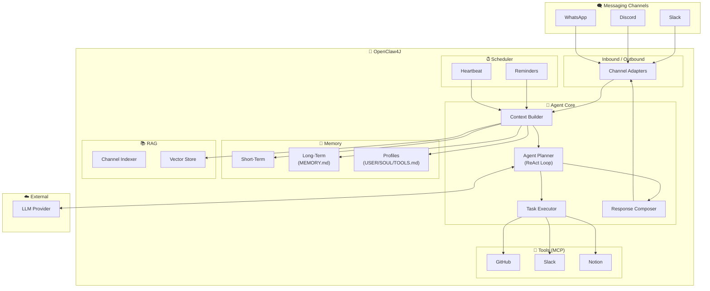
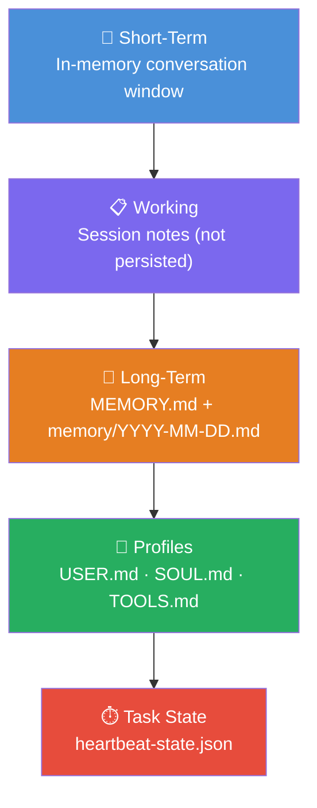

# 🦞 OpenClaw4J

> **An autonomous AI agent framework for Java** — built with Spring Boot 3.5.10, Spring AI 1.1.2, and Java 25.

OpenClaw4J is an intelligent agent that lives inside your messaging channels. Send it a message in natural language — it reads, understands, plans, and executes tasks using LLM reasoning, MCP tools, RAG retrieval, and layered persistent memory — then reports back in the same channel.

---

## Architecture Overview



## How It Works

```
User sends message in Slack
        │
        ▼
┌─────────────────────────────┐
│  1. Channel Adapter         │  Normalize platform event → InboundMessage
├─────────────────────────────┤
│  2. Context Builder         │  Assemble memory + RAG + history + tools
├─────────────────────────────┤
│  3. Agent Planner (ReAct)   │  LLM reasons: Think → Act → Observe → Repeat
├─────────────────────────────┤
│  4. Task Executor           │  Invoke MCP tools (GitHub, Slack, Notion…)
├─────────────────────────────┤
│  5. Response Composer       │  Format result for the target channel
├─────────────────────────────┤
│  6. Channel Adapter         │  Post response back to Slack
└─────────────────────────────┘
        │
        ▼
User receives agent response
```

## Key Features

| Feature | Description |
|---------|-------------|
| **Multi-channel** | Slack (MVP) → Discord → WhatsApp |
| **Agentic reasoning** | ReAct loop with LLM-powered planning |
| **MCP tools** | GitHub issues/PRs, Slack messaging, Notion pages |
| **RAG knowledge** | Vector-indexed channel history for contextual answers |
| **Layered memory** | Short-term → working → long-term → profiles → task state |
| **Reminders** | Time-based reminders with cron scheduling |
| **Heartbeat** | Periodic background checks and proactive notifications |

## Technology Stack

| Component | Technology |
|-----------|-----------|
| Language | Java 25 (records, sealed types, virtual threads, structured concurrency) |
| Framework | Spring Boot 3.5.10 (modular starters, declarative clients, `@Retryable`) |
| AI | Spring AI 1.1.2 (ChatClient, OpenAI, Ollama, Tools) |
| Tools | GitHub API, Slack Bolt SDK |
| Vector Store | PGVector (PostgreSQL) |
| Build | Gradle (Kotlin DSL) |
| Testing | JUnit 5, Testcontainers, WireMock, RestTestClient |
| Observability | Micrometer + OpenTelemetry |

## Project Structure

```
openclaw4j/
├── docs/                                # Specification & documentation
│   ├── PRD.md                           # Product requirements & technical spec
│   ├── README.md                        # This file
│   └── learning/                        # Learning guides per slice
│
├── src/main/java/dev/prasadgaikwad/openclaw4j/
│   ├── OpenClaw4JApplication.java       # Entry point
│   ├── channel/                         # Channel adapters (Slack, Console)
│   │   ├── ChannelAdapter.java          # Sealed interface
│   │   └── slack/                       # Slack implementation
│   ├── agent/                           # Agent core (planner, service, context)
│   ├── config/                          # Configuration (AIConfig, SlackAppConfig)
│   ├── memory/                          # Memory management (ShortTermMemory)
│   ├── tool/                            # Tool System (ToolRegistry, AITool)
│   └── util/                            # Utilities
│
├── src/main/resources/
│   ├── application.yml
│   └── prompts/                         # System prompt templates (system.prompt)
│
├── memory/                              # Agent's persistent brain (gitignored)
│   ├── MEMORY.md                        # Curated long-term memory
│   ├── USER.md                          # User preferences
│   ├── SOUL.md                          # Agent personality & behavior
│   ├── TOOLS.md                         # Environment & tool notes
│   └── heartbeat-state.json             # Scheduler state
│
└── build.gradle
```

## Memory System



**Recall protocol:** Before answering about past work, preferences, or todos, the agent searches `MEMORY.md` + `memory/*.md`, loads only needed lines, and includes them in the prompt context.

## MVP Roadmap

| Slice | Name | Goal | Status |
|-------|------|------|--------|
| **MVP-1** | Foundation | Echo bot on Slack — project scaffold, channel adapter | Done |
| **MVP-2** | Intelligence | LLM-powered responses with conversation history | Done |
| **MVP-3** | Tools | MCP tool execution (GitHub, Slack tools) | Done |
| **MVP-4** | Memory | Persistent layered memory system | In Progress |
| **MVP-5** | RAG | Vector-indexed channel history for knowledge retrieval | Next |
| **MVP-6** | Scheduler | Reminders, heartbeat, periodic tasks | Next |
| **MVP-7** | Polish | Notion tool, compound tasks, Discord adapter | Next |

> See [docs/PRD.md](./PRD.md) for the full specification with detailed diagrams.

## Getting Started

> 🚧 **Coming soon** — MVP-1 implementation will include setup instructions.

### Prerequisites

- Java 25+
- Gradle 8+
- Node.js (for npx-based MCP servers)
- PostgreSQL 16+ (for PGVector)
- A Slack workspace with bot permissions
- An LLM API key (OpenAI, Anthropic, or Ollama)

### Slack App Setup

> 📝 **Step-by-step guide:** See [docs/SLACK_SETUP.md](./SLACK_SETUP.md) for detailed instructions on creating your Slack App, configuring scopes, and getting your tokens.

### Configuring LLM Providers

OpenClaw4J supports multiple LLM providers. You can switch them without changing code by updating `application.yml` or using command-line arguments.

#### Switching via Property
Set the provider in `src/main/resources/application.yml`:

```yaml
openclaw4j:
  ai:
    provider: ollama # or 'openai'
```

#### Running with Ollama (Local)
1. Ensure Ollama is running (`ollama serve`).
2. Activate the `ollama` profile and set the provider:
   ```bash
   ./gradlew bootRun --args='--spring.profiles.active=ollama --openclaw4j.ai.provider=ollama'
   ```

#### Running with OpenAI (Cloud)
1. Set your API key: `export SPRING_AI_OPENAI_API_KEY=sk-...`
2. Run with default settings or explicit profile:
   ```bash
   ./gradlew bootRun --args='--spring.profiles.active=openai --openclaw4j.ai.provider=openai'
   ```

### Quick Start

```bash
# Clone the repository
git clone https://github.com/your-org/openclaw4j.git
cd openclaw4j

# Copy environment template
cp .env.example .env
# Edit .env with your API keys and tokens

# Run the application
./gradlew bootRun
```

## Design Principles

1. **Functional first** — Immutable records, pure functions, stream pipelines, pattern matching
2. **Folder clarity** — Each folder is a bounded context; no unnecessary nesting
3. **Educational** — Thorough comments explaining *why*, not just *what*
4. **Incremental delivery** — Each MVP slice is fully functional end-to-end
5. **Privacy by default** — Memory files gitignored, no actions without user confirmation

## License

MIT

---

*Built with ❤️ using Spring Boot 3.5.10, Spring AI 1.1.2, and Java 25.*
